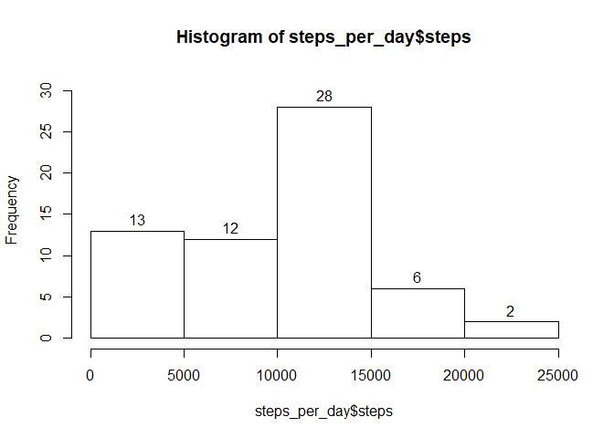
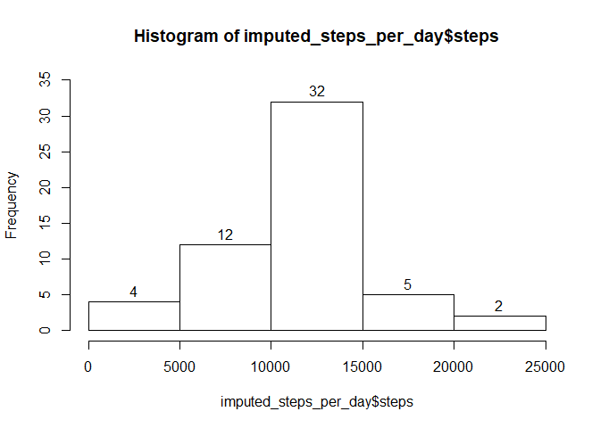

## Loading and preprocessing the data

```r
# Load packages
library(dplyr, warn.conflicts=FALSE, quietly=TRUE)      # to group the data frames
library(lattice)    # for the time series plot
library(stringr)    # for str_pad

data <- read.csv("activity.csv", stringsAsFactors = FALSE)
data$date <- as.Date(data$date)
```


## What is mean total number of steps taken per day?

```r
# Total number of steps taken per day
data %>% group_by(date) %>%
		summarize(steps = sum(steps)) %>% 
		as.data.frame()	-> 
		steps_per_day
steps_per_day[is.na(steps_per_day$steps), "steps"] <- 0

# Histogram
vertical_limit <- max(hist(steps_per_day$steps, plot = FALSE)$counts)

hist(steps_per_day$steps, labels = TRUE,
     ylim = c(0, vertical_limit + 3))
```

<!-- -->

```r
# Mean and median
cat(    "Mean: ", mean(steps_per_day$steps), "\n", 
        "Median: ", median(steps_per_day$steps), 
        sep="")
```

```
## Mean: 9354.23
## Median: 10395
```


## What is the average daily activity pattern?

```r
# Total number of steps taken per 5-minute interval
compacted <- data[!is.na(data$steps), ]
compacted %>% group_by(interval) %>%
		summarize(mean_steps = mean(steps)) %>% 
		as.data.frame() -> steps_per_interval

xyplot(mean_steps ~ interval, steps_per_interval, type = "l")
```

<!-- -->

Most active interval:

```r
most_active_interval <- steps_per_interval[	steps_per_interval$mean_steps == 
											max(steps_per_interval$mean_steps),
											"interval"]
most_active_interval
```

```
## [1] 835
```


## Imputing missing values
The missing values were imputed by using the mean of the interval across all 
days, _i.e._, if the interval 0800 was N.A. on day _x_, the mean of the 
interval 0800 was  calculated across all the days in which it's not NA, and 
this mean was used to replace these NAs.


```r
# Calculate and report the total number of missing values in the dataset
data[is.na(data$steps), ] %>%
		nrow() %>% 
		paste("records with missing values.") %>%
		print()
```

```
## [1] "2304 records with missing values."
```

```r
# Define 2 functions for ease of understanding of the code below.
meanFor5MinuteInterval <- function(intvl, steps_per_interval) {
	return_value <- steps_per_interval[
			steps_per_interval$interval == intvl, 
			"mean_steps"]
			
	return_value
}

batchMeanFor5MinuteInterval <- 	function(dataframe, 
								fill_vector, 
								steps_by_interval) {
	
	range <- 1:nrow(dataframe[fill_vector, ])
	
	for (i in range) {
		dataframe[i, "steps"] <- 
				meanFor5MinuteInterval(dataframe[i, 
						"interval"], 
						steps_per_interval)
	}
	
	dataframe
}

imputed_data <- data
NAs_to_fill <- is.na(data$steps)
imputed_data <- batchMeanFor5MinuteInterval(
		imputed_data, 
		NAs_to_fill,
		steps_per_interval)
		
# Make a histogram of the total number of steps taken each day...		
imputed_data %>% 
		group_by(date) %>% 
		summarize(steps = sum(steps)) ->
		imputed_steps_per_day

vertical_limit = max(hist(imputed_steps_per_day$steps, plot = FALSE)$counts)

hist(imputed_steps_per_day$steps, 
     labels = TRUE,
     ylim = c(0, vertical_limit + 3))
```

<!-- -->

```r
# ... and calculate and report the mean and median.
imputed_steps_per_day[is.na(imputed_steps_per_day$steps), "steps"] <- 0
mean(imputed_steps_per_day$steps)
```

```
## [1] 9728.107
```

```r
median(imputed_steps_per_day$steps)
```

```
## [1] 10600
```


## Are there differences in activity patterns between weekdays and weekends?

```r
# weekdays vs. weekends 
imputed_data %>%
	mutate(dayOfTheWeek = as.POSIXlt(date)$wday) %>%
	as.data.frame() ->
	imputed_data
	
imputed_data %>%
	mutate(isWeekend = case_when(
			(dayOfTheWeek == 1 | dayOfTheWeek == 6) ~ "Weekend",
			TRUE ~ "Weekday")) %>%
	as.data.frame() ->
	imputed_data
	
imputed_data <- select(imputed_data, -dayOfTheWeek)

imputed_data$isWeekend <- as.factor(imputed_data$isWeekend)

compacted <- imputed_data[!is.na(imputed_data$steps), ]
compacted %>% group_by(interval, isWeekend) %>%
		summarize(mean_steps = mean(steps)) %>% 
		as.data.frame() -> steps_per_interval
		
xyplot(mean_steps ~ interval | isWeekend,
		steps_per_interval, 
		type = "l",
		layout = c(1,2))
```

<!-- -->
